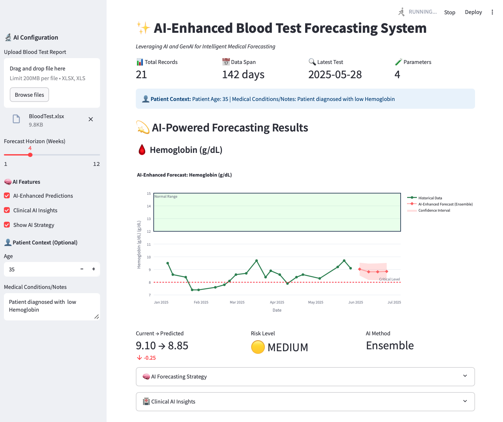

# 🩸 AI-Enhanced Blood Test Forecasting System

*Leveraging AI and GenAI for Intelligent Medical Forecasting*

[](https://python.org)
[](https://streamlit.io)
[]()
[]()
[](https://learn.microsoft.com/en-us/azure/architecture/hybrid/hybrid-start-here) [](https://en.wikipedia.org/wiki/Machine_learning)

## 🌟 Overview

An advanced medical forecasting application that combines traditional Machine Learning with Generative AI to predict blood test parameter trends. The system provides intelligent clinical insights, risk assessment, and personalized recommendations for healthcare monitoring.



### Key Innovation
- **Hybrid AI Architecture**: ML models for base predictions + GenAI for clinical enhancement
- **Smart Model Selection**: AI-powered selection of optimal forecasting methods
- **Medical Context Awareness**: Patient-specific insights and recommendations
- **Risk-Based Analysis**: Intelligent health trend monitoring with early warning systems

## ✨ Features

### 🤖 AI/GenAI Capabilities
- **Smart Ensemble Forecasting**: Random Forest + Gradient Boosting with intelligent weighting
- **GenAI Enhancement**: Google Gemini API for prediction refinement and clinical insights
- **Adaptive Model Selection**: AI recommends optimal forecasting approach per parameter
- **Clinical Intelligence**: Medical knowledge integration for safer predictions

### 📊 Blood Parameter Analysis
- **Hemoglobin** (g/dL): Anemia detection and monitoring
- **RBC Count** (mill/cmm): Red blood cell trend analysis
- **Leukocyte Count** (/cumm): Immune system monitoring
- **Platelet Count** (Lakh/Cumm): Bleeding risk assessment

### 🔬 Advanced Analytics
- Dynamic confidence intervals based on model agreement
- Normal range compliance tracking
- Critical threshold alerting
- Overall health risk scoring (0-4 scale)
- Trend analysis with seasonality detection

### 👤 Patient Context Integration
- Age-based recommendations
- Medical condition considerations
- Personalized risk assessments
- Treatment timeline optimization

## 🏗️ Architecture

```
┌─────────────────┐    ┌─────────────────┐    ┌──────────────────┐
│   Data Input    │───▶│  ML Forecasting │───▶│ GenAI Enhancement│
│  (Excel Upload) │    │ (Random Forest +│    │                  │
│                 │    │Gradient Boosting│    │  (Gemini API)    │
│                 │    │      Models)    │    │                  │
└─────────────────┘    └─────────────────┘    └──────────────────┘
                                │                       │
                                ▼                       ▼
┌─────────────────┐    ┌─────────────────┐    ┌──────────────────┐
│ Risk Assessment │◀───│ Smart Ensemble  │───▶│Clinical Insights │
│   & Alerting    │    │   Predictions   │    │ & Recommendations│
└─────────────────┘    └─────────────────┘    └──────────────────┘
```

### Core Components

1. **AIForecastOptimizer**: GenAI-powered strategy optimization
2. **SmartEnsembleForecaster**: Advanced ML ensemble with feature engineering
3. **AIBloodTestForecaster**: Main orchestrator with method selection
4. **Interactive Dashboard**: Streamlit-based clinical interface

## 🚀 Quick Start

### Prerequisites
- Python 3.8+
- Google Gemini API key
- Excel file with blood test data

### Installation

```bash
# Clone repository
git clone <repository-url>
cd ai-blood-test-forecasting

# Install dependencies
pip install -r requirements.txt

# Set up environment variables
echo "GEMINI_API_KEY=your_gemini_api_key_here" > .env
```

### Required Dependencies
```txt
streamlit>=1.28.0
pandas>=1.5.0
numpy>=1.24.0
plotly>=5.15.0
scikit-learn>=1.3.0
requests>=2.31.0
python-dotenv>=1.0.0
openpyxl>=3.1.0
prophet>=1.1.4      # For advanced time series forecasting
statsmodels>=0.14.0 # For ARIMA models
```

### Launch Application
```bash
streamlit run blood_test_dashboard_GenAI.py

🐳 Build and Run with Docker Compose

docker compose up -d --build

```

## 📋 Data Format

Your Excel file should contain these columns:

| Date | Hemoglobin g/dL 12.0 - 15.0 | RBC Count mill/cmm 3.80 - 4.80 | Leukocyte Count (TLC/WBC) /cumm 4.00 - 10.00 | Platelet Count Lakh/Cumm 1.50 - 4.5 |
|------|------------------------------|----------------------------------|-----------------------------------------------|--------------------------------------|
| 2025-05-23 | 12.0 | 3.80 | 4.00 | 1.50 |

**Requirements:**
- Minimum 4 data points per parameter
- Date column in recognizable format
- Exact column naming as shown above

## 🎛️ Configuration Options

### AI Settings
- **Prediction Horizon**: 1-12 weeks
- **AI-Enhanced Predictions**: Toggle GenAI enhancement
- **Clinical Insights**: Enable AI-generated medical insights
- **Forecast Strategy Display**: Show AI methodology selection

### Patient Context
- **Age**: For age-specific risk assessment
- **Medical Conditions**: Additional context for AI analysis
- **Treatment History**: Relevant medical background

## 📈 Model Performance

### Quality Metrics (Rating: 8.5/10)

**Strengths:**
- ✅ Hybrid AI architecture with redundancy
- ✅ Medical domain knowledge integration
- ✅ Robust error handling and fallbacks
- ✅ Patient-specific contextual analysis
- ✅ Multiple forecasting method support

**Technical Highlights:**
- Weighted ensemble (RF: 60%, GB: 40%)
- Dynamic confidence intervals
- Feature engineering with 8+ time-based features
- Intelligent method selection via GenAI

### Validation Approach
- Model agreement-based confidence intervals
- Critical threshold violation detection
- Risk stratification validation
- Medical plausibility checks

## 🔒 Security & Privacy

- **API Key Protection**: Environment variable storage
- **Data Privacy**: No data persistence beyond session
- **Medical Compliance**: Appropriate disclaimers and warnings
- **Error Handling**: Graceful degradation without API access

## ⚠️ Important Disclaimers

**Medical Disclaimer**: This AI-powered analysis is for informational and research purposes only. Predictions are based on statistical models and should not replace professional medical advice. Always consult qualified healthcare professionals for medical decisions and treatment plans.

**Data Accuracy**: Forecasts depend on data quality and quantity. Minimum 4 data points required per parameter for reliable predictions.

## 🛠️ Advanced Usage

### Custom Model Integration
```python
# Add custom forecasting models
forecaster.ml_models['custom'] = YourCustomModel()

# Modify weighting scheme
weights = {'rf': 0.4, 'gb': 0.3, 'custom': 0.3}
```

### API Integration
```python
# Access AI optimizer directly
optimizer = AIForecastOptimizer(api_key="your_key")
strategy = optimizer.optimize_forecast_strategy(data, param_info)
```

## 🚧 Development Roadmap

### Possible Enhancements
- [ ] Backtesting and cross-validation metrics
- [ ] Integration with electronic health records
- [ ] Mobile-responsive interface
- [ ] Multi-patient database support
- [ ] Advanced risk scoring algorithms
- [ ] Clinical decision support integration

### Model Improvements
- [ ] Transformer-based time series models
- [ ] Uncertainty quantification enhancement
- [ ] Multi-parameter correlation analysis
- [ ] Seasonal pattern recognition

## 📄 License

This project is licensed under the MIT License - see the LICENSE file for details.


---

**Built with ❤️ for better healthcare outcomes through AI innovation**

[]() []()

